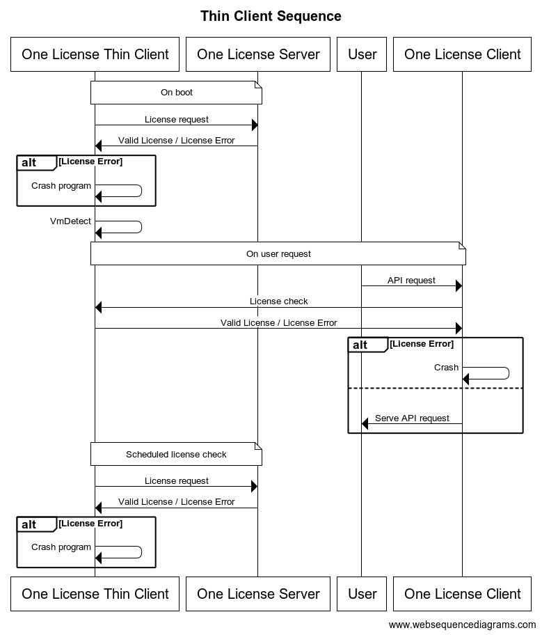

## Sequence Diagram



### Code

```
title Thin Client Sequence

note over One License Thin Client,One License Server: On boot

One License Thin Client->One License Server: License request

One License Server->One License Thin Client:Valid License / License Error

alt License Error
    One License Thin Client->One License Thin Client: Crash program
end

One License Thin Client->One License Thin Client: VmDetect

note over One License Thin Client,User,One License Client, One License Server: On user request

User->One License Client: API request
One License Client->One License Thin Client: License check
One License Thin Client->One License Client: Valid License / License Error

alt License Error
    One License Client->One License Client: Crash
else
    One License Client->User: Serve API request
end

note over One License Thin Client, One License Server: Scheduled license check

One License Thin Client->One License Server: License request

One License Server->One License Thin Client:Valid License / License Error

alt License Error
    One License Thin Client->One License Thin Client: Crash program
end
```
